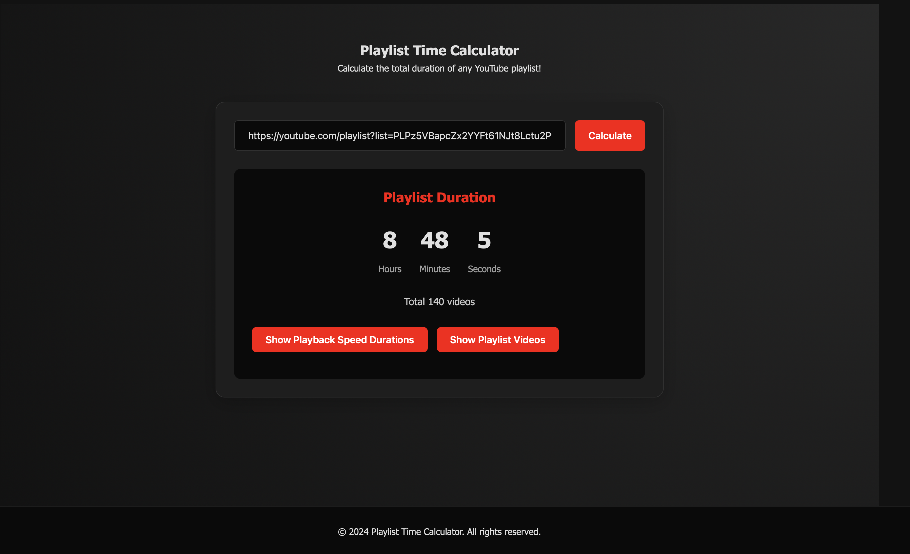
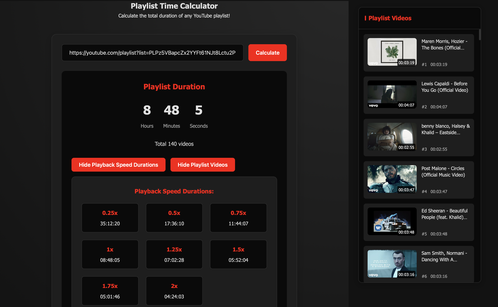

# Playlist Time Calculator

A web application that calculates the total duration of YouTube playlists with additional playback speed calculations.

## Screenshots


*Main interface of the application*


*Example of duration calculation with different playback speeds*


*Detailed view of playlist videos with individual durations*

## Features

- Calculate total playlist duration instantly
- View durations with different playback speeds (0.25x to 2x)
- List all videos in the playlist with their individual durations
- Clean and responsive design for all devices
- User-friendly interface with real-time calculations

## Installation

1. Clone the repository:
```bash
git clone https://github.com/SentralPrime/playlist-time-calculator.git
```
2. Get your YouTube Data API key from Google Cloud Console:
   - Go to https://console.cloud.google.com/apis/credentials
   - Create a new project or select an existing one
   - Enable the YouTube Data API v3
   - Create credentials (API key)
3. Open `script.js` and replace `YOUR_YOUTUBE_API_KEY` with your actual API key
4. Open `index.html` in a web browser

## Usage

1. Enter a YouTube playlist URL in the input field
2. Click "Calculate" or press Enter
3. View the total duration and different playback speed calculations
4. Browse through the complete list of playlist videos

## Technologies

- HTML5
- CSS3
- JavaScript (ES6+)
- YouTube Data API v3
- Responsive Design

## Author

- **Ibrahim Unal (Prime)**
- Instagram: [@ibrahimunalprime](https://www.instagram.com/ibrahimunalprime/)
- GitHub: [SentralPrime](https://github.com/SentralPrime)

## License

This project is licensed under the MIT License. See the [LICENSE](LICENSE) file for details.

## Contributing

Contributions, issues, and feature requests are welcome! Feel free to check [issues page](https://github.com/SentralPrime/playlist-time-calculator/issues). 